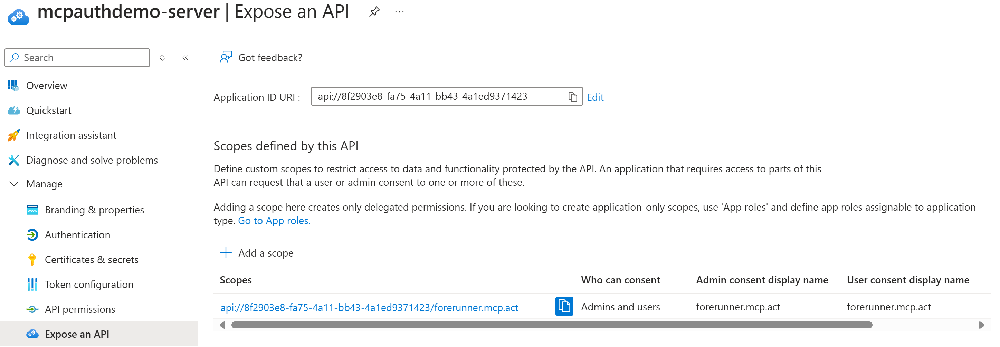
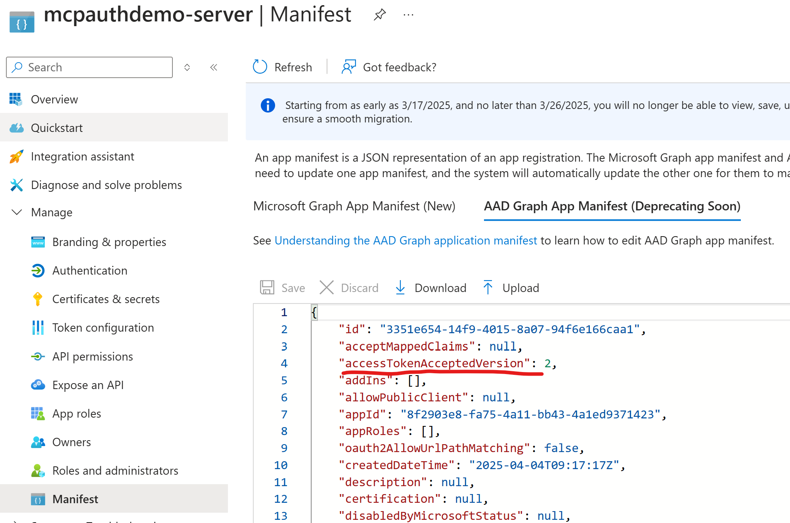
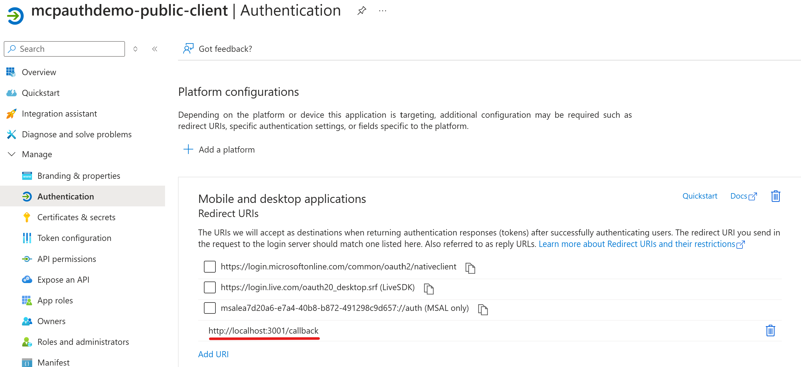

This fork returns a virtual app registration to MCP Client, which will be converted to a shared app registration provided by MCP Server. So developers can successfully use Entra ID to authenticate between MCP Client and MCP Server without requiring Entra ID to support DCR. The MCP Server acts as a proxy to Entra ID and handles OAuth callback for the virtual app registration.


# 🔒 Minimal Entra ID-authenticated MCP Server

Minimal server showing how to implement Entra ID authentication with MCP and HTTP+SSE transport.

>[!WARNING]
>This is not intended for production use. If you are to adopt any of the practices in this implementation, ensure that you are implementing proper caching and secure token/credential handling practices.

## Run server

```
npm install
npm run build
npm run start
```

## Testing

You will need to use [**MCP Inspector**](https://github.com/modelcontextprotocol/inspector) or a tool that supports HTTP+SSE transport for MCP servers _and_ authentication.

## Steps to try the demo:

### 1. Create Entra ID app registration A

This app registration is used to protect to the MCP Server with Entra ID

1. Creat a new single tenant Entra ID app registration, let's name it as `mcpauthdemo-server`. Feel free to use other name you like.
1. Expose an API with scope name `forerunner.mcp.act`. This MCP Server requires access token with this scope, see `Server.ts`'s line 19. When Entra ID asks you to specify Application ID URI, use the default value, which is in the format `api://<current-app-client-id>`. 
1. Create a new client secret
1. Open the app's Manifest and specify `"accessTokenAcceptedVersion": 2` in the AAD Graph App Manifest. Save the change. This demo server expects a v2 token. 

### 2. Create Entra ID app registration B

This app registration is used by MCP Client to acquire an access token to MCP Server

1. Create another new single tenant Entra ID app registration, let's name it `mcpauthdemo-public-client`. Feel free to use other name you like.
1. Add a new redirect url with following configuration
    1. Platform: Mobile and desktop applications
    1. Custom redirectt URI: `http://localhost:3001/callback` (this MCP Server's callback url)
    

### 3. Configure and run the demo

1. Create a new `.env` file in the root of this repository
1. Add following environment variables to the `.env` file:
    ``` env
    FR_TENANT_ID=<app registration A's tenant id>
    FR_API_CLIENT_ID=<app registration A's client id>
    FR_API_CLIENT_SECRET=<app registration A's client secret>
    FR_PUBLIC_CLIENT_ID=<app registration B's client id>
    ```
1. Run `npm install`, `npm run build` and `npm run start` to start the server.
1. Follow [**MCP Inspector**](https://github.com/modelcontextprotocol/inspector)'s instruction to start MCP Inspector.
1. Open MCP Inspect. The default address should be `http://127.0.0.1:6274 `.
1. Click `Connect`. You should be asked to login. After login, the MCP Inspect shows you have successfully authenticated MCP Server. From developer tool, you can see the requests to MCP Server contains the authorization header with an access token, whose audience is app_registration_A, and scope is forerunner.mcp.act.